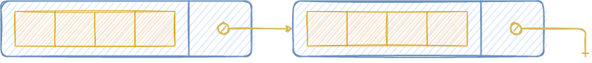

# StackChunked

## Overview

Stack implemented using a linked list of arrays of fixed size.



## Implementation

```java
public class StackChunked<E> implements Stack<E> {

  private static final int DEFAULT_CAPACITY = 64;

  private Node<E> first;
  private Node<E> loiteringNode;
  private int size;

  public StackChunked() {
    first = null;
    loiteringNode = null;
    size = 0;
  }

  @Override
  public void push(E e) {
    if (loiteringNode == null || loiteringNode.isFull()) {
      first = new Node<>(first);
      loiteringNode = first;
    } else if (first == null || first.isFull()) {
      first = loiteringNode;
    }

    first.add(e);

    size++;
  }

  @Override
  public E pop() {
    if (isEmpty()) {
      throw new NoSuchElementException();
    }

    E old = first.remove();

    if (first.isEmpty()) {
      first = first.next;
    }
    if (loiteringNode.next.isEmpty()) {
      loiteringNode = loiteringNode.next;
    }

    size--;

    return old;
  }

  @Override
  public E peek() {
    return first.peek();
  }

  @Override
  public int size() {
    return size;
  }

  @Override
  public boolean isEmpty() {
    return size == 0;
  }

  @Override
  public Iterator<E> iterator() {
    return new StackChunkedIterator();
  }

  private static class Node<E> implements Iterable<E> {

    final E[] arr;
    final Node<E> next;
    int size;

    Node(Node<E> next) {
      this.arr = (E[]) new Object[DEFAULT_CAPACITY];
      this.next = next;
      this.size = 0;
    }

    void add(E e) {
      arr[size++] = e;
    }

    E remove() {
      if (isEmpty()) {
        throw new NoSuchElementException();
      }

      E old = arr[--size];
      arr[size] = null;
      return old;
    }

    E peek() {
      return arr[size - 1];
    }

    boolean isEmpty() {
      return size == 0;
    }

    boolean isFull() {
      return size == arr.length;
    }

    @Override
    public Iterator<E> iterator() {
      return new NodeIterator();
    }

    @Override
    public String toString() {
      return Arrays.toString(arr);
    }

    private class NodeIterator implements Iterator<E> {

      int i = size;

      @Override
      public boolean hasNext() {
        return i > 0;
      }

      @Override
      public E next() {
        if (!hasNext()) {
          throw new NoSuchElementException();
        }

        return arr[--i];
      }
    }
  }

  private class StackChunkedIterator implements Iterator<E> {

    Node<E> node;
    Iterator<E> nodeIterator;

    public StackChunkedIterator() {
      node = first;
      nodeIterator = node == null ? null : first.iterator();
    }

    @Override
    public boolean hasNext() {
      return node != null;
    }

    @Override
    public E next() {
      if (!hasNext()) {
        throw new NoSuchElementException();
      }

      E next = nodeIterator.next();

      if (!nodeIterator.hasNext()) {
        node = node.next;
        nodeIterator = !hasNext() ? null : node.iterator();
      }

      return next;
    }
  }
}
```

## Complexity

| Space |
| :--- |
| $$O(n),\ O(n)$$ |

| Procedure | Time |
| :--- | :--- |
| `void push(E item)` | $$O(1),\ O(1)$$ |
| `E pop()` | $$O(1),\ O(1)$$ |
| `E peek()` | $$O(1),\ O(1)$$ |
| `int size()` | $$O(1),\ O(1)$$ |
| `boolean isEmpty()` | $$O(1),\ O(1)$$ |

## Notes

Combines pros of both resizing array and linked list:

* No copy of array when resizing, hence `void push(E item)` and `E pop()` are $$O(1)$$ in the worst case.
* Bigger granularity of memory allocations compared to the linked list \(fixed-sized array of elements vs one element\), thus no overhead.
* Smaller impact of a node pointer on memory overhead.

One disadvantage is the reduced locality of reference compared to [ArrayStack](arraystack.md), but locality is better compared to [LinkedStack](linkedstack.md).

