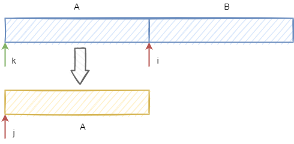

# MergeSortTopDown

## Overview

Implementation of merge sort using top-down recursive approach.

```text
Start with unsorted list I of n items
Break I into two halves I1 and I2, having n/2 and n/2-1 items
Sort I1 recursively, yielding S1
Sort I2 recursively, yielding S2
Merge S1 and S2 into one sorted list S
```

## Implementation

```java
public class MergeSortTopDown {

  public static <T extends Comparable<? super T>> void sort(T[] arr) {
    T[] aux = (T[]) new Comparable[arr.length];
    sort(arr, aux, 0, arr.length - 1);
  }

  private static <T extends Comparable<? super T>> void sort(T[] arr, T[] aux, int lo, int hi) {
    if (hi <= lo) {
      return;
    }

    int mid = (lo + hi) >>> 1;
    sort(arr, aux, lo, mid);
    sort(arr, aux, mid + 1, hi);
    merge(arr, aux, hi, lo, mid);
  }


  // [lo, mid] [mid+1, hi]
  private static <T extends Comparable<? super T>> void merge(
      T[] arr, T[] aux, int lo, int mid, int hi) {
    System.arraycopy(arr, lo, aux, lo, hi - lo + 1);

    int i = lo;
    int j = mid + 1;

    for (int k = lo; k <= hi; k++) {
      if (i > mid) {
        arr[k] = aux[j++];
      } else if (j > hi) {
        arr[k] = aux[i++];
      } else if (aux[j].compareTo(aux[i]) < 0) {
        arr[k] = aux[j++];
      } else {
        arr[k] = aux[i++];
      }
    }
  }
}
```

## Complexity

| Space | Time | Stability |
| :--- | :--- | :--- |
| $$O(n),\ O(n)$$ | $$O(n\ log\ n),\ O(n\ log\ n),\ O(n\ log\ n)$$ | Stable |

## Implementation notes

Given implementation of merge function uses a modified [merge algorithm](../../merge-algorithms/merge/merge.md), using one sorted input array divided into two parts.

## Improvements

* [Insertion sort](../insertion-sort/) for small subarrays.
* Stop if already sorted \(biggest item in first half ≤ smallest item in the second half\). Gives $$O(n)$$ complexity for the sorted array.
* Merge function can be implemented to use $$N/2$$ memory. We copy the first half of the array into a new array of length $$N/2$$and use this first half as the start of the output array.



* Merge can be done in $$O(1)$$ space complexity.

## Notes

Merge sort is used to sort a linked list in place.

Merge sort is used as an external sorting algorithm.

